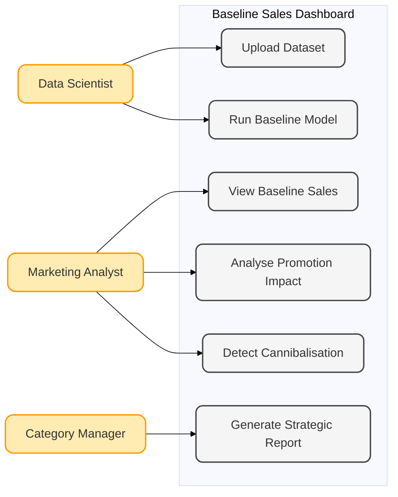

# Requirements

*This section outlines the business problem, target stakeholders, and the core functional and non-functional requirements defined during the discovery phase of the project.*

---

## Project Background

Retail sales data for Fast-Moving Consumer Goods (FMCG) is inherently noisy. Historical sales figures are frequently distorted by tactical commercial interventions—such as temporary price reductions, multi-buy promotions, and seasonal marketing campaigns. This noise makes it difficult for decision-makers to discern "true demand." Without a clear baseline, Coca-Cola faces challenges in measuring the genuine return on investment (ROI) of marketing activities and understanding organic portfolio growth.

---

## Client Introduction

This project was conducted in collaboration with **Coca-Cola Europacific Partners**, a leading global beverage company. They provided access to real-world retail sales data and strategic guidance, enabling the development of a dashboard tailored to their commercial and marketing decision-making needs. The system is designed to deliver actionable insights directly relevant to Coca-Cola's product portfolio and promotional planning.

---

## Project Approach

To address the challenges of noisy sales data and promotional effects, our team developed an interactive dashboard that combines time-series forecasting with machine learning. The system estimates baseline demand, quantifies promotional uplift, and identifies cross-product cannibalisation, providing actionable insights for marketing and commercial teams.

---

## Project Goals

### Technical Goals

* **Recover the Sales Baseline:** Accurately estimate consumer demand in the absence of promotional interventions.
* **Decouple Variables:** Isolate the impact of seasonality, pricing, and promotions.
* **Scale for Portfolio Management:** Build a system capable of handling cross-product interactions, specifically identifying cannibalisation effects.

### Non-Technical Goals

* **Enable Data-Driven Decisions:** Provide a modular, interactive interface that translates complex model outputs into actionable insights for stakeholders.
* **Improve Decision Efficiency:** Reduce manual analysis time for marketing and commercial teams by delivering clear, visualised metrics.
* **Support Stakeholder Communication:** Facilitate cross-department collaboration by presenting insights in an intuitive, accessible format.

---

## Gathering Requirements

Requirements were collected through direct stakeholder engagement and iterative consultations. A key component of this process was an in-depth interview with **Mr. Muhammad, Director of Data Science and AI** at **Coca-Cola Europacific Partners**, which provided qualitative insights into the specific challenges and priorities of the business. The interview explored recurring decision-making processes, the methods currently used to track promotional effectiveness, data limitations, and gaps in cross-department communication. These findings guided the identification of functional needs, key performance metrics, and the design of a dashboard that addresses both analytical rigor for data teams and actionable insights for marketing and commercial stakeholders. By leveraging the interview results, we were able to define requirements that are precise, relevant, and closely aligned with their business.

<h3 style="color:#E41E26; margin-bottom:1rem;">Interview Findings</h3>

    

        
Which decisions do you make regularly that involve sales or promotions data?

        
I evaluate which promotions are most effective and advise marketing on where to allocate future budgets.

    

    

        
How do you currently track and evaluate the impact of promotions?

        
Mostly through manual Excel models using Nielsen data and post-promotion sales comparisons.

    

    

        
What challenges do you face when analysing sales data and promotions impact?

        
It is difficult to isolate the true sales baseline and control for overlapping factors such as seasonality and pricing changes.

    

    

        
Are there any specific tasks that take too long or are difficult with your current tools?

        
Cleaning and preparing weekly data from different regions requires several hours each cycle.

    

    

        
What information is often missing or hard to find when evaluating promotions?

        
Cannibalisation effects and long-term uplift are not visible in the current analytical setup.

    

    

        
What key metrics or insights would be most valuable for your work?

        
Baseline sales, incremental uplift, and promotion ROI by product and channel.

    

    

        
How often would you check the dashboard?

        
Weekly before performance review meetings, with occasional ad-hoc usage.

    

    

        
Are there any gaps between technical teams and departments like marketing?

        
Yes. Marketing teams prefer quick, visual insights, whereas analysts focus on complex models, creating a gap in translating data into clear business actions.

    

---

## Personas

  <!-- First row: image left, text right -->
  

    

      
    

    

      <h3>Marketing Team Lead</h3>
      
Mark Etting oversees promotional planning and strategic marketing decisions. The Baseline Modelling Dashboard enables rapid assessment of recent promotions, highlighting which initiatives achieved significant sales uplift and identifying instances of cross-product cannibalization. The dashboard allows Mark to extract actionable insights and generate summary reports to inform upcoming promotion strategies.

    

  

  <!-- Second row: image right, text left -->
  

    

      
    

    

      <h3>Data Analyst</h3>
      
Anna Liszt is responsible for preparing sales and promotion performance reports. The Baseline Modelling Dashboard automates data preprocessing and baseline calculations, allowing her to focus on interpreting results. She evaluates promotion effectiveness, identifies genuine incremental sales versus cannibalization, and produces concise insights to support marketing decision-making.

    

  

---

## Use Cases

**UC1: Upload Dataset**  
Data Scientists upload raw sales and promotion datasets to the system.  
Handles preprocessing and prepares data for modeling.

**UC2: Run Baseline Model**  
Data Scientists execute the time-series forecasting model (e.g., SARIMAX/Prophet) to estimate baseline sales.  
Automatically separates promotional effects, seasonality, and trends.

**UC3: View Baseline Sales**  
Marketing Analysts view actual sales vs. estimated baseline in interactive charts.  
Helps identify “hidden demand” not influenced by promotions.

**UC4: Analyse Promotion Impact**  
Analysts select specific promotional periods.  
System calculates uplift (Actual Sales − Baseline Sales) to determine ROI.

**UC5: Detect Cannibalisation**  
Analysts examine cross-product interactions.  
Identifies if promotions on one SKU reduce sales of another (e.g., Diet Coke vs. Coke Zero).

**UC6: Generate Strategic Report**  
Category Managers create summary reports based on model outputs.  
Supports strategic decision-making and presentation-ready insights.

---

## MoSCoW Requirements List

### Functional Requirements

| Requirement | Priority | Description |
|:---|:---|:---|
| **Baseline Demand Estimation** | Must Have | The system shall implement a time-series forecasting model (Prophet) to estimate the counterfactual baseline sales for each SKU, removing the effects of promotions, pricing changes, and external factors. |
| **Sales vs Baseline Visualisation** | Must Have | The dashboard shall display actual sales alongside estimated baseline sales in an interactive time-series chart, enabling users to visually compare deviations caused by promotions. |
| **Promotional Uplift Calculation** | Must Have | The system shall compute promotional uplift as the difference between actual sales and baseline sales over selected time periods, allowing users to quantify campaign effectiveness. |
| **Seasonality and Trend Decomposition** | Must Have | The system shall decompose sales data into trend, seasonality, and residual components, providing transparency into the underlying drivers of demand. |
| **Interactive SKU Selection** | Must Have | Users shall be able to dynamically filter and select individual SKUs or product categories to analyse specific product performance. |
| **Data Preprocessing Pipeline** | Must Have | The system shall automatically clean and preprocess raw NielsenIQ data, including handling missing values, aligning time indices, and standardising SKU-level datasets. |
| **Cannibalisation Analysis** | Must Have | The system shall identify and quantify cross-product cannibalisation effects using machine learning models (e.g., LightGBM), showing how promotions of one product impact others. |
| **Cross-Validation Metrics Display** | Must Have | The dashboard shall display model performance metrics (e.g., RMSE, MAE) to allow users to assess the reliability of forecasts. |
| **Interactive Dashboard Interface** | Must Have | The system shall provide an intuitive Streamlit-based interface with interactive widgets (filters, selectors, sliders) for real-time data exploration. |
| **Forecasting Capability** | Should Have | The system shall generate forward-looking sales forecasts based on historical trends and modelled components. |
| **Export Functionality** | Should Have | Users shall be able to export key insights, charts, or summaries (e.g., as CSV or PDF) for reporting and presentation purposes. |
| **Widget-Based Custom Layout** | Should Have | The dashboard shall support modular widgets that can be dynamically added or arranged by the user to customise their analytical view. |
| **Multi-SKU Comparison** | Could Have | Users may compare multiple SKUs simultaneously to evaluate relative performance and promotional impact across products. |
| **Automated Insight Generation** | Could Have | The system may provide simple automated insights (e.g., “Promotion X increased sales by 25%”) to support non-technical users. |
| **Real-Time Data Integration** | Won’t Have | Integration with live corporate databases or real-time streaming data is out of scope due to access and infrastructure constraints. |

---

### Non-Functional Requirements

| Requirement | Priority | Description |
|:---|:---|:---|
| **Performance** | Must Have | The dashboard shall load and render visualisations within a few seconds for typical SKU-level queries to ensure a smooth user experience. |
| **Usability** | Must Have | The interface shall be intuitive and require minimal technical knowledge, enabling marketing and commercial users to interpret results without training. |
| **Scalability** | Must Have | The system shall handle multiple SKUs and large time-series datasets without significant degradation in performance. |
| **Reliability** | Must Have | The system shall produce consistent and reproducible results given the same input data and parameters. |
| **Maintainability** | Must Have | The codebase shall be modular and well-documented to allow future developers to update models, add features, or fix issues efficiently. |
| **Transparency** | Must Have | The system shall expose model components (trend, seasonality, residuals) and performance metrics to ensure interpretability for stakeholders. |
| **Portability** | Must Have | The application shall be deployable on different environments (local machine, Azure VM) with minimal configuration changes. |
| **Compatibility** | Should Have | The dashboard shall be accessible via modern web browsers without requiring additional installations. |
| **Security** | Should Have | Basic access control (e.g., controlled deployment environment) shall be maintained to prevent unauthorised access to proprietary data. |
| **Extensibility** | Should Have | The system shall be designed to allow integration of additional models (e.g., alternative forecasting methods) in the future. |
| **Documentation Quality** | Should Have | Clear user and deployment documentation shall be provided to support both technical and non-technical stakeholders. |
| **Aesthetic Design** | Could Have | The dashboard shall present data in a visually clear and professional manner to enhance readability and stakeholder engagement. |
| **Availability** | Could Have | The deployed system (Azure VM) should be available for access during demonstration and client review periods. |
| **Real-Time Fault Tolerance** | Won’t Have | Advanced fault tolerance or distributed system resilience is not required due to the prototype nature of the project. |

