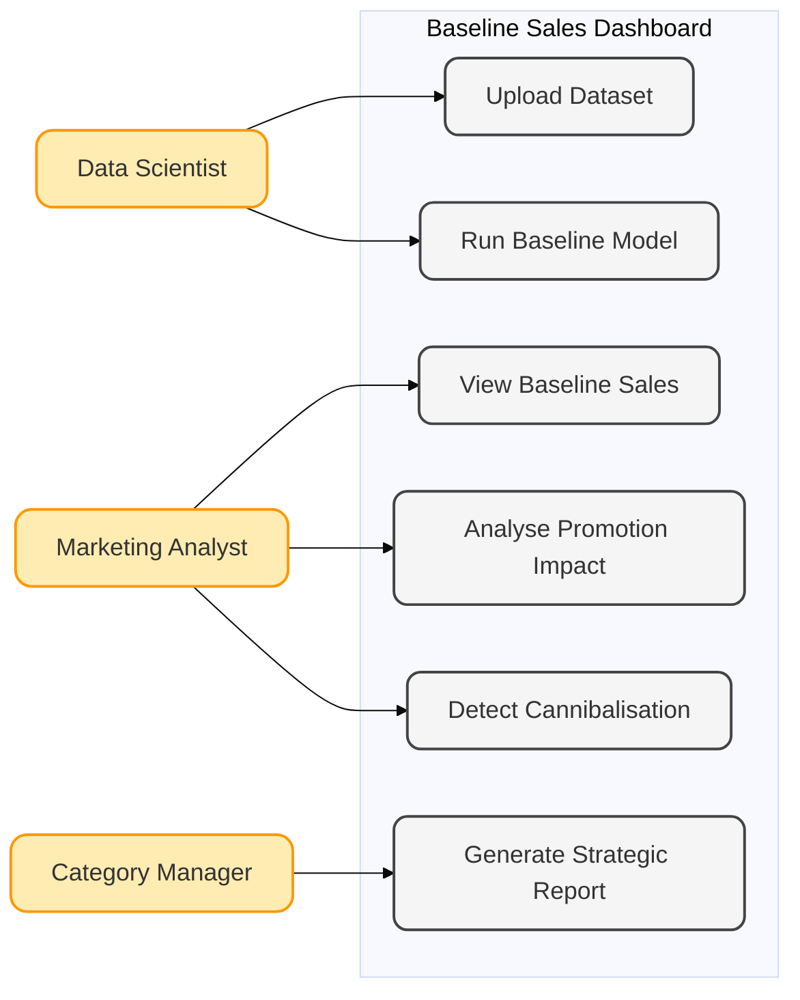

# Requirements

*This section outlines the business problem, target stakeholders, and the core functional and non-functional requirements defined during the discovery phase of the project.*

---

## Project Background

Retail sales data for Fast-Moving Consumer Goods (FMCG) is inherently noisy. Historical sales figures are frequently distorted by tactical commercial interventions—such as temporary price reductions, multi-buy promotions, and seasonal marketing campaigns. This noise makes it difficult for decision-makers to discern "true demand." Without a clear baseline, Coca-Cola faces challenges in measuring the genuine return on investment (ROI) of marketing activities and understanding organic portfolio growth.

---

## Client Introduction

This project was conducted in collaboration with Coca-Cola, a global leader in the Fast-Moving Consumer Goods (FMCG) industry. The partner provided access to real-world retail sales data and defined the core business problem addressed in this project.

In the FMCG sector, sales data is inherently complex and noisy due to the frequent use of promotions, pricing strategies, and seasonal campaigns. These factors distort observed sales, making it difficult to identify the true underlying consumer demand, commonly referred to as baseline sales. As a result, organisations face challenges in accurately evaluating the effectiveness of promotional activities and making informed strategic decisions.

The objective of this project is to develop a system capable of estimating baseline demand by separating it from promotional effects, and to present these insights through an interactive and accessible dashboard for stakeholders.

---

## Project Goals

*   **Recover the Sales Baseline:** Accurately estimate consumer demand in the absence of promotional interventions.
*   **Decouple Variables:** Isolate the impact of seasonality, pricing, and promotions.
*   **Enable Data-Driven Decisions:** Provide a modular, interactive interface that translates complex time-series models into actionable commercial insights.
*   **Scale for Portfolio Management:** Build a system capable of handling cross-product interactions, specifically identifying cannibalisation effects.

---

## Gathering Requirements
Requirements were gathered through a series of iterative stakeholder consultations. We mapped the needs of three distinct departments to determine the necessary level of abstraction for the dashboard:

*   **Data Analysts:** Required raw data access, trend decomposition, and model transparency.
*   **Marketing Teams:** Required high-level performance indicators and clear "promotion vs. baseline" metrics.
*   **Commercial Teams:** Required portfolio-level summaries to facilitate broader strategic planning.

---

## Personas

  <!-- First row: image left, text right -->
  

    

      
    

    

      <h3>Marketing Team Lead</h3>
      
Mark Etting oversees promotional planning and strategic marketing decisions. The Baseline Modelling Dashboard enables rapid assessment of recent promotions, highlighting which initiatives achieved significant sales uplift and identifying instances of cross-product cannibalization. The dashboard allows Mark to extract actionable insights and generate summary reports to inform upcoming promotion strategies.

    

  

  <!-- Second row: image right, text left -->
  

    

      
    

    

      <h3>Data Analyst</h3>
      
Anna Liszt is responsible for preparing sales and promotion performance reports. The Baseline Modelling Dashboard automates data preprocessing and baseline calculations, allowing her to focus on interpreting results. She evaluates promotion effectiveness, identifies genuine incremental sales versus cannibalization, and produces concise insights to support marketing decision-making.

    

  

---

## Use Cases
*   **UC1: Baseline Recovery:** User selects an SKU; the system calculates the counterfactual baseline and visualizes it against actual sales to reveal the "hidden" demand.
*   **UC2: Promotion Assessment:** User selects a promotional period; the system calculates the uplift (Actual Sales minus Baseline) to determine campaign ROI.
*   **UC3: Cross-Product Impact:** User investigates a price drop on a key product (e.g., Coke Zero) to see if it causes a decline in a sister product (e.g., Diet Coke), quantifying cannibalisation.
*   **UC4: Dynamic Portfolio Analysis:** User toggles between SKUs to compare performance metrics across different product lines.

---

## MoSCoW Requirements List

| Requirement | Category | Description |
|:---|:---|:---|
| **Baseline Forecasting** | Must Have | Implement SARIMAX to isolate baseline demand from promo noise. |
| **Interactive Dashboard** | Must Have | A Streamlit-based UI for visualizing sales vs. baseline. |
| **Data Cleaning Pipeline** | Must Have | Automated handling of missing/null Nielsen sales entries. |
| **Promotional Uplift** | Must Have | Calculation logic to quantify the impact of promo flags. |
| **Cannibalisation Model** | Must Have | Use Gradient Boosted Trees (LightGBM) to link multi-product sales. |
| **Seasonal Decomposition** | Must Have | Visual breakdown of Trend, Seasonality, and Noise. |
| **Automated Reporting** | Could Have | Export functionality for PDF summaries of performance. |
| **Real-Time DB Sync** | Won't Have | Direct live-streaming from corporate SQL servers (out of scope). |
