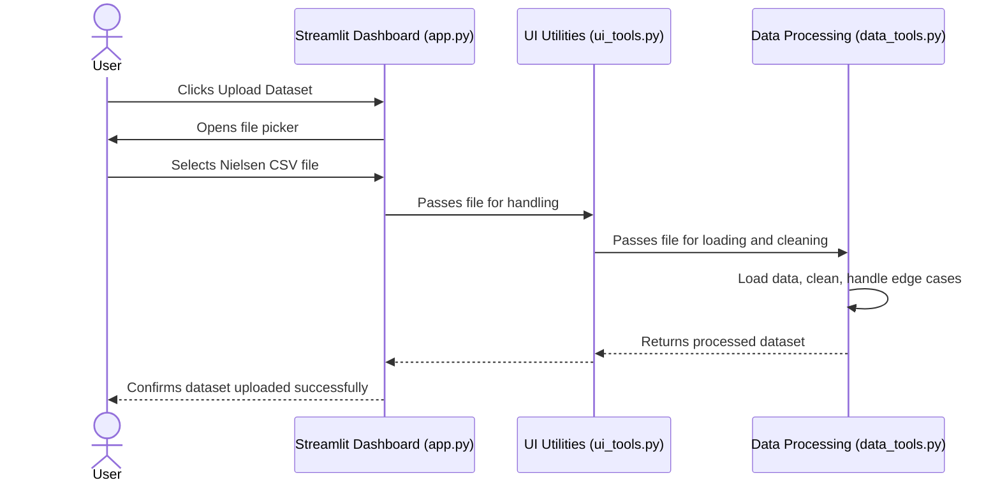
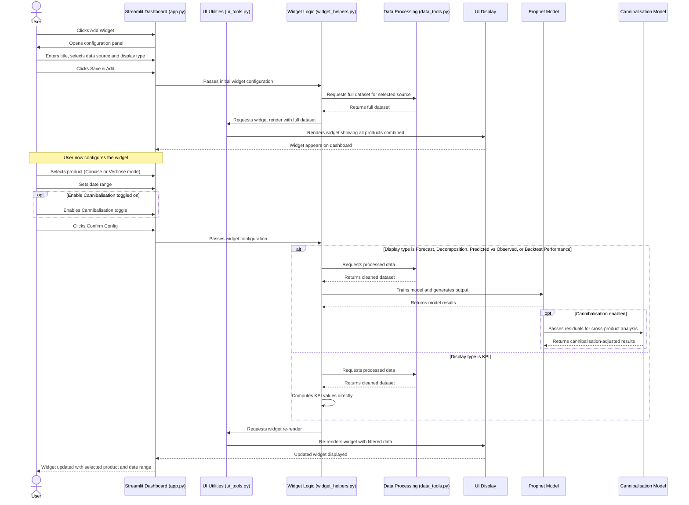
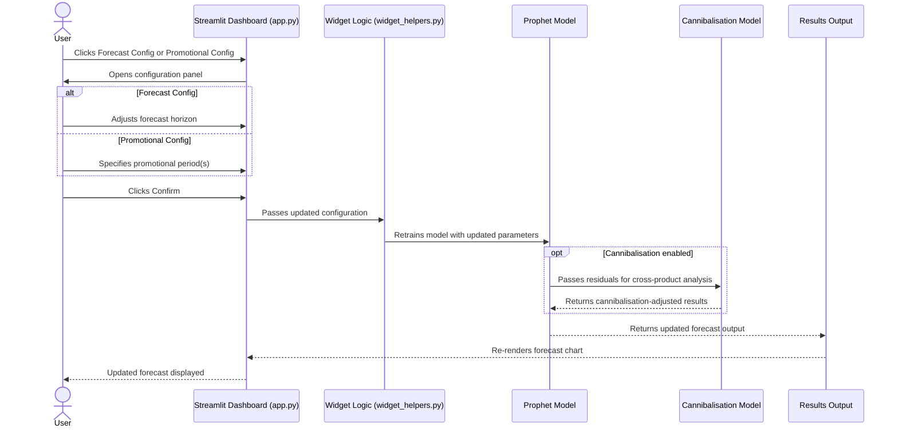
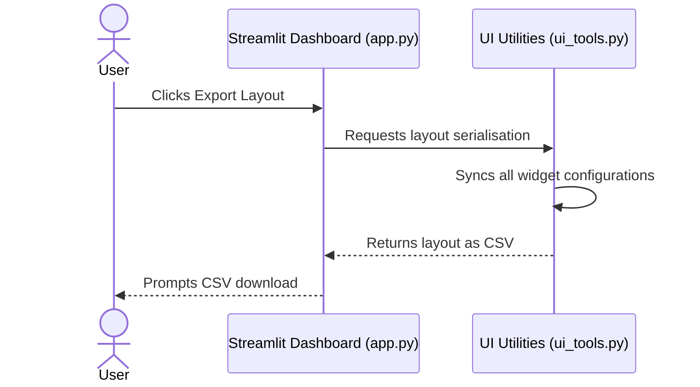

# System Design

*This section outlines the technical architecture of the dashboard, covering the system components, data flow, sequence diagrams, design patterns, and data storage.*

---

## System Architecture

The diagram below illustrates the end-to-end pipeline of the application, from user interaction through to results output.

### Component Descriptions

**USER (Marketer / Analyst)**

The end user of the application. The system is designed to serve two distinct user types: Marketing leads who require quick visual insights, and data analysts who require deeper analytical views.

**Streamlit Dashboard (`app.py`)**

The entry point of the application. Handles the general app layout.

**UI Utilities (`ui_tools.py`)**

Responsible for UI-level operations including importing and exporting widget layouts, rendering widgets onto the dashboard, and handling data file imports.

**Widget Logic (`widget_helpers.py`)**

Manages the logic for individual widgets, including new widget creation, filter selection, date range picking, and KPI display logic.

**Data Processing (`data_tools.py`)**

Handles all data operations: loading new data, cleaning, computing KPI values, and managing edge cases in the input data.

**Data Source**

Nielsen sales data provided as CSV files. These files are uploaded by the user and processed locally on the server.

**Prophet Model**

The core forecasting model. Trains on the processed dataset, predicts sales, computes and graphs predictions, and generates forecasts for future windows.

**Cannibalisation Model (Optional)**

An optional LightGBM-based model that performs cross-product comparisons to account for cannibalisation effects within the forecast.

**Results Output**

Aggregates the model outputs into the following display types: KPI metrics, Predicted vs Observed sales, Forecasting graph, Decomposition graphs, and Backtest error graphs.

**UI Display**

Renders the final results as interactive charts, dynamic KPIs, and configurable widgets. Layouts can be exported for future sessions.

---

## Sequence Diagrams

### 1. Uploading a Dataset

---

### 2. Adding and Configuring a Widget

---

### 3. Forecast / Promotion Config for Forecast Widget

---

### 4. Exporting a Layout

---

## Design Patterns

### Modular Architecture
The application is structured into distinct modules — `app.py`, `ui_tools.py`, `widget_helpers.py`, and `data_tools.py` — each with a clearly defined responsibility. This separation of concerns ensures that changes to one module do not affect others, improving maintainability and readability.

### Pipeline Pattern
Data flows through the system in a linear pipeline: raw input → data processing → model training → results output → UI display. Each stage transforms the data and passes it to the next, making the flow predictable and easy to debug.

### Strategy Pattern
The widget system applies a strategy pattern for display types. Each display type (KPI, Forecast, Decomposition, Predicted vs Observed, Backtest Performance) implements its own rendering logic, but is invoked through a consistent interface. This allows new display types to be added without modifying the core widget logic.

---

## Data Storage

The application does not use a database. Uploaded Nielsen CSV files are stored in the local file system of the server running the application. Widget layout configurations can be exported and saved as CSV files by the user, and re-imported in future sessions. No data is transmitted to external servers.