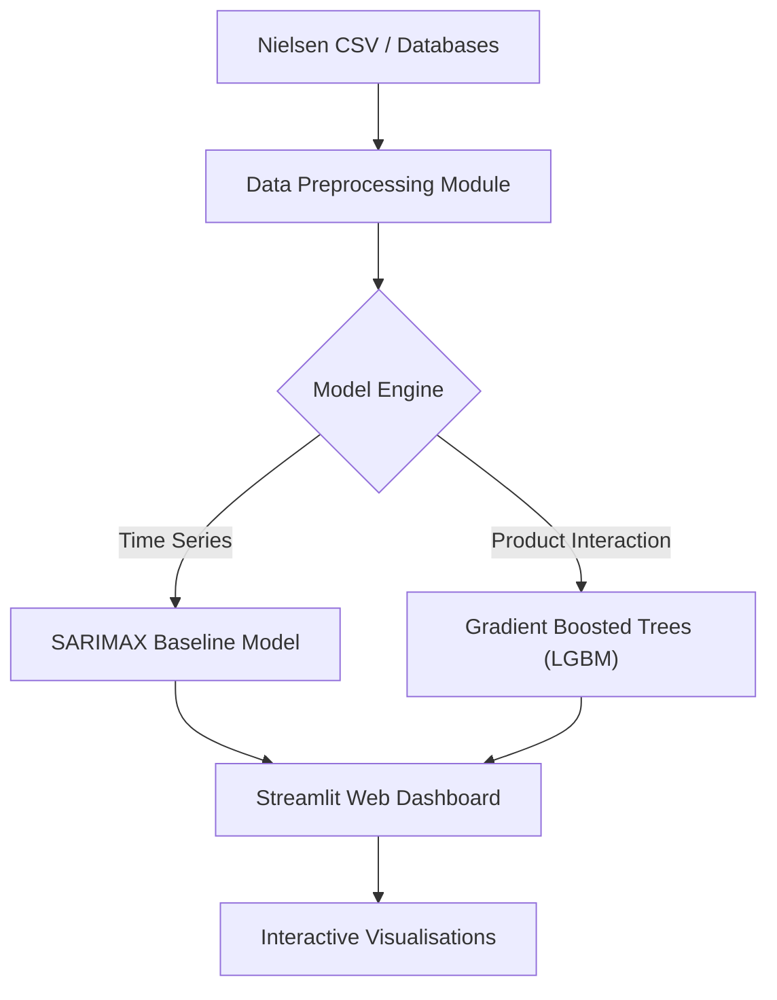
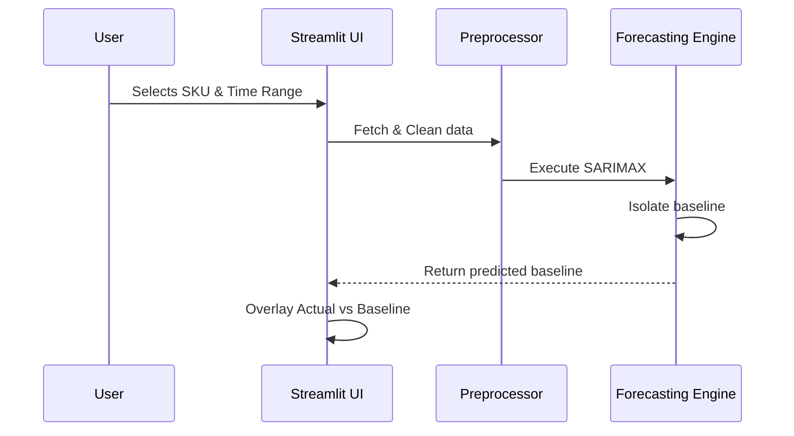

# System Design
*This section provides a formal overview of the system architecture, detailing the structural components, data flow, and design patterns that ensure the scalability and modularity of the demand intelligence tool.*

---

## System Architecture
The system follows a **Modular Monolithic Architecture**, designed for high performance in data analysis and rapid development via Streamlit.

*   **Data Layer:** Stores raw Nielsen sales data, promotion calendars, and pricing logs.
*   **Processing Layer (Backend):** Contains the core logic for time-series decomposition, SARIMAX forecasting, and cannibalisation modeling.
*   **Presentation Layer (Frontend):** The Streamlit dashboard that serves as the interface for business stakeholders.

---

## Sequence Diagrams
This diagram illustrates the logic flow when a user requests a baseline forecast, highlighting the interaction between the UI, the preprocessing pipeline, and the model engine.

---

## Design Patterns
*   **Strategy Pattern:** Used in the Model Engine. We have a "Baseline Strategy" (SARIMAX) and a "Cannibalisation Strategy" (LightGBM). This allows us to swap or add new models without refactoring the entire dashboard codebase.
*   **Singleton Pattern:** Used in the `DataLoader` component to ensure the large Nielsen dataset is loaded into memory only once per session (`@st.cache_data`), preventing redundant I/O operations.

---

## Data Storage
The system currently uses a structured CSV-based data warehouse approach, representing an entity-relationship structure designed for time-series analysis.

| Table | Fields |
| :--- | :--- |
| **Product** | `sku_id` (PK), `product_name`, `base_price` |
| **Time_Series** | `entry_id` (PK), `sku_id` (FK), `date`, `volume`, `is_promoted` (bool) |

---

## Packages and APIs
*   **Data Handling:** `pandas`, `numpy`
*   **Forecasting/ML:** `statsmodels` (SARIMAX), `lightgbm` (Cannibalisation), `scikit-learn` (Preprocessing)
*   **Interface:** `streamlit` (Dashboard Framework)
*   **Version Control:** The project is modularized into packages (e.g., `src/models/`, `src/visualization/`, `src/data/`) for transparency and GitHub-based collaboration.

[Back to top](#system-design)