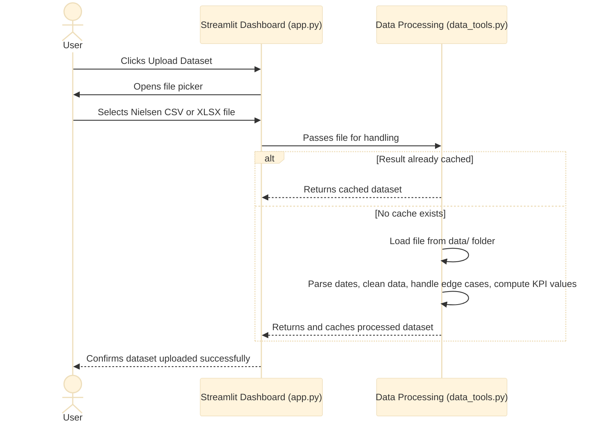
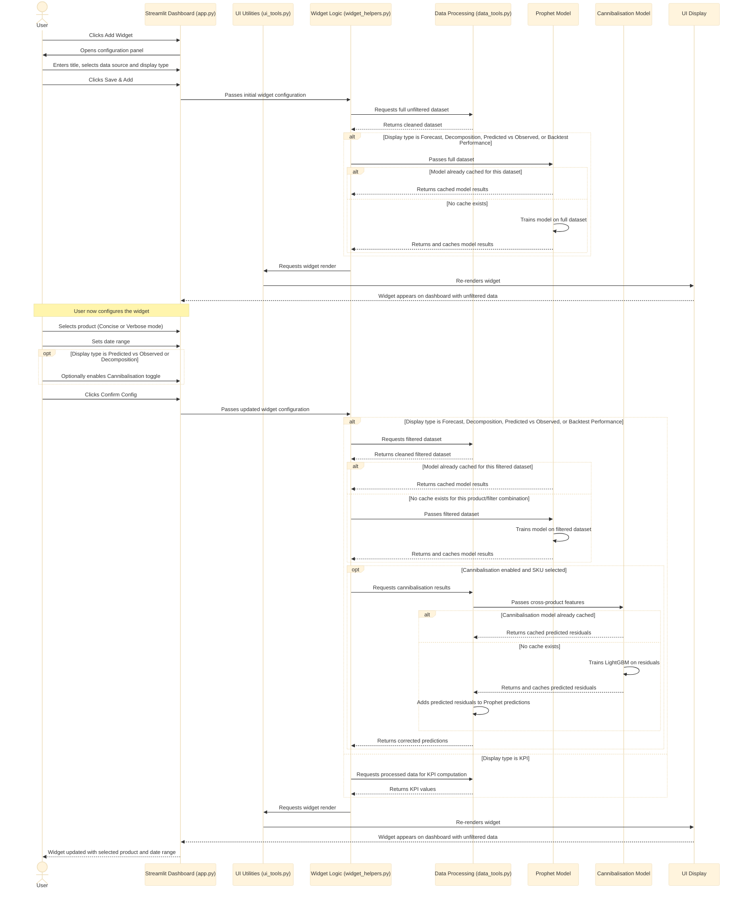
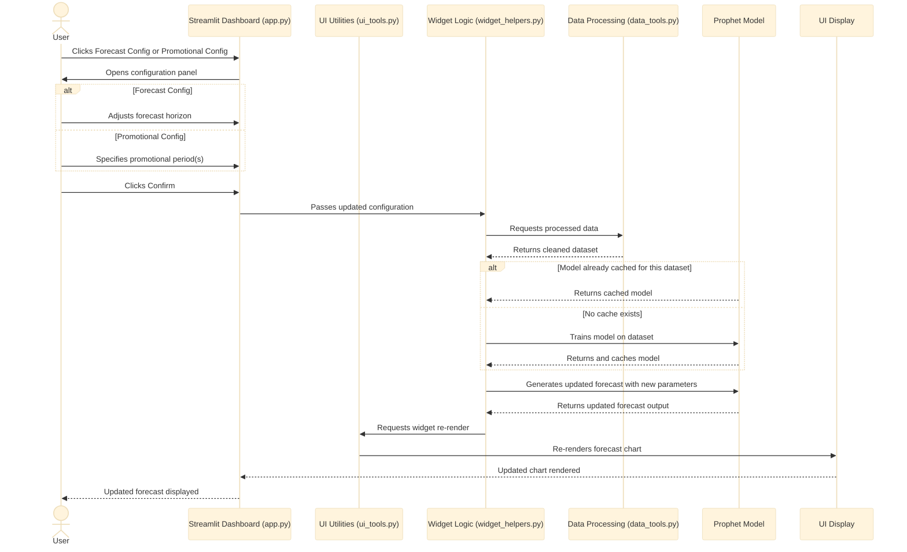
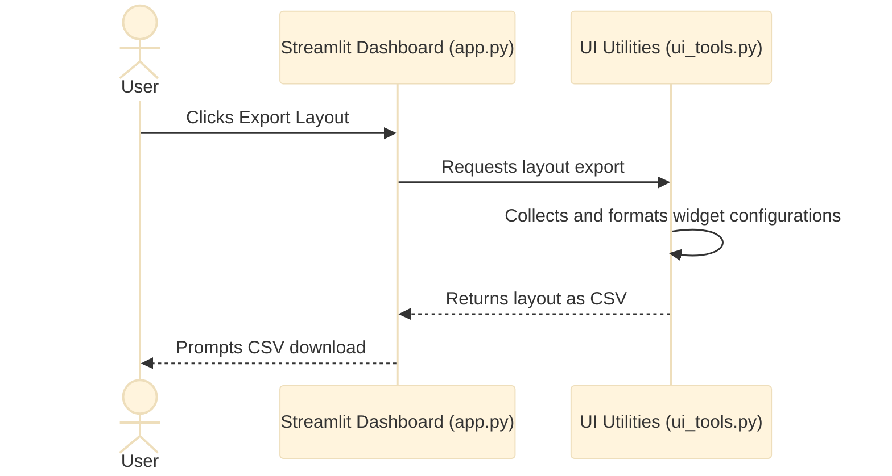

# System Design

*This section outlines the technical architecture of the dashboard, covering the system components, data flow, sequence diagrams, design patterns, and data storage.*

---

## System Architecture

The diagram below illustrates the end-to-end pipeline of the application, from user interaction through to results output.

### Component Descriptions

**USER (Marketer / Analyst)**

The end user of the application. The system is designed to serve two distinct user types, marketing leads who require quick visual insights, and data analysts who require deeper analytical views.

**Streamlit Dashboard (`app.py`)**

The entry point of the application. Handles the general app layout.

**UI Utilities (`ui_tools.py`)**

Responsible for UI-level operations including importing and exporting widget layouts, rendering widgets onto the dashboard, and handling data file imports.

**Widget Logic (`widget_helpers.py`)**

Manages the logic for individual widgets, including new widget creation, filter selection, date range picking, KPI display logic, and rendering each display type.

**Data Processing (`data_tools.py`)**

Handles all data operations: loading data, cleaning, computing KPI values, and orchestrating calls to the Prophet and Cannibalisation models. It also handles edge cases.

**Data Source**

Nielsen sales data provided as CSV or XLSX files. Files are stored in the `data/` folder on the device running the application and loaded by filename.

**Prophet Model**

The core forecasting model. Trains on the processed dataset with yearly seasonality and a promotional regressor. Used by Forecast, Decomposition, Predicted Vs. Observed, and Backtest Performance widgets. Results are cached via `@st.cache_resource`, and the model only retrains when a new input dataframe is passed.

**Cannibalisation Model**

An optional model that does cross-product comparisons to predict what the Prophet residuals should be. Used by **Predicted vs Observed** and **Decomposition** widgets when the cannibalisation toggle is enabled and a SKU is selected. 

**Results Output**

Aggregates the model outputs into the following display types: KPI metrics, Predicted vs Observed sales, Forecasting graph, Decomposition graphs, and Backtest error graphs.

**UI Display**

Renders the final results as interactive charts, dynamic KPIs, and configurable widgets. Layouts can be exported for future sessions.

---

## Sequence Diagrams

Many features share similar underlying flows, so documenting each individually would introduce unnecessary repetition. Therefore, the sequence diagrams presented here are representative of the broader application, chosen to provide clarity without exhausting every possible interaction.

---

### 1. Uploading a Dataset

---

### 2. Adding and Configuring a Widget

---

### 3. Forecast / Promotion Config for Forecast Widget

---

### 4. Exporting a Layout

---

## Design Patterns

### Separation of Concerns
Each module has a clearly defined responsibility with minimal overlap. `data_tools.py` handles all data loading, cleaning, and model orchestration. `widget_helpers.py` handles widget rendering and display logic. `ui_tools.py` handles layout management. `app.py` handles the top-level application structure. In most cases, changes to one module do not require changes to others 

### Modular Design
Rather than one large script, the application is split into distinct modules that are easier to navigate, test, and extend. For example, adding a new widget display type would only require adding a render function to `widget_helpers.py`, a new case in `ui_tools.py`'s `match_and_render`, and a new entry in `global_const.py`. The data and model layers are untouched.

### Functional Decomposition
Complex operations are broken down into smaller, single-purpose functions that can be reasoned about and tested independently. For example, `get_forecast_df` delegates to `get_total_matches`, `process_data`, and `run_prophet_model` rather than handling everything itself. This also means those sub-functions can be reused elsewhere.

### Caching
Expensive operations are cached using Streamlit's `@st.cache_data` and `@st.cache_resource` decorators. `@st.cache_data` is used for functions returning dataframes, such as `load_data` and `get_performance_metrics`. While `@st.cache_resource` is used for trained model objects, such as those returned by `run_prophet_model` and `run_cannibal_model`. This prevents redundant computation when the same data or model is needed across multiple widgets.

---

## Data Storage

The application does not use a database. Nielsen sales data files are stored persistently in a `data/` folder on the device running the application, and are loaded by filename. Widget layout configurations can be exported and saved as CSV files by the user, and re-imported in future sessions. No data is transmitted to external servers.

